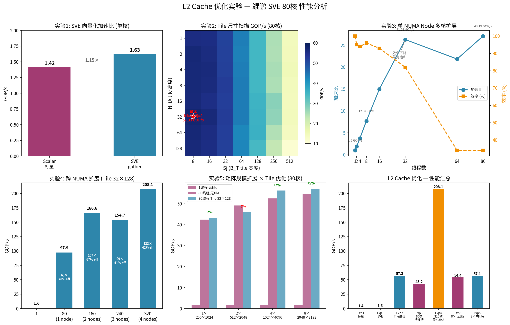

# 实验 1-5：L2 Cache 查表法矩阵乘法 — 详细实验报告

## 1. 实验背景

### 1.1 问题

FP8 查表法矩阵乘法的查找表（LUT）大小为 **256 KiB**（256×256 float），鲲鹏 L1d 仅 **64 KiB/核**，因此 LUT 永远无法放入 L1，每次查表至少命中 L2（~12 周期）。本系列实验（1-5）在 LUT 驻留 L2 的前提下，探索 SVE 向量化、Tile 分块、多核扩展、跨 NUMA 扩展等各种优化手段的效果。

### 1.2 计算模型

查表法用查表替代乘法：

```cpp
sum += table[(A[i][k] << 8) | B_T[j][k]];  // 一次查表 = 一次随机加载
```

总操作数（查表次数）：`Total_ops = N × S × L`

吞吐率：`GOP/s = N × S × L / time_us / 1000`

每条数据需要从 LUT 中随机加载 4 字节，每次 GOP 对应一次随机 4B 加载，因此查表法是典型的 **memory-bound** 任务。

### 1.3 核心数据结构

| 项目 | 大小 | 说明 |
|------|------|------|
| LUT | 256 KiB | 256×256 float，全程驻留 L2 |
| A 矩阵 | N × L × 1B | uint8_t，每元素 1 字节 |
| B_T 矩阵 | S × L × 1B | uint8_t，每元素 1 字节 |
| C 矩阵 | N × S × 4B | float 输出 |
| 工作集总和 | N×L + S×L + N×S×4 + 256K | 随矩阵规模增长 |

### 1.4 测试平台

| 项目 | 值 |
|------|-----|
| CPU | HiSilicon Kunpeng 920, 4路 |
| 物理核 | 320 (80核/socket × 4) |
| SVE 宽度 | 256-bit (svcntw()=8) |
| L1d | 64 KiB/核 |
| L2 | 1280 KiB/核 |
| L3 | 70 MiB/NUMA node |
| NUMA | 8 nodes, 各 80 CPUs |
| 编译器 | g++ -O3 -fopenmp -march=armv8.2-a+sve |
| 运行绑定 | `OMP_PLACES=cores OMP_PROC_BIND=close`（单 node） |

---

## 2. 核函数设计

四个等级的核函数，优化力度递增：

### 2.1 `lookup_scalar` — 标量基线

逐元素查表累加，单核串行。编译器展开循环后乱序执行可隐藏部分 L2 延迟。

```cpp
for (int i = 0; i < N; ++i)
    for (int j = 0; j < S; ++j) {
        float sum = 0.0f;
        for (int k = 0; k < L; ++k)
            sum += table[(rA[k] << 8) | rB[k]];
        C[i * S + j] = sum;
    }
```

### 2.2 `lookup_sve` — SVE gather 向量化

用 `svld1_gather_u32index_f32` 一次 gather 加载 8 个 float，理论上 8 路并行隐藏 L2 延迟。

```cpp
svuint32_t idx = svorr_u32_z(pg, svlsl_n_u32_z(pg, idxA, 8), idxB);
acc = svadd_f32_z(pg, acc, svld1_gather_u32index_f32(pg, table, idx));
```

鲲鹏的 gather 指令微码化了多个 μop，每个元素独立访问 L2。8 个随机地址的 L2 访问难以流水，延迟被串行化。

### 2.3 `lookup_sve_omp` — SVE + OpenMP 行并行

外层 `#pragma omp parallel for schedule(static)` 将 N 行均分给各线程。每核独立计算不同的 C[i][j]，缓存行私有，无竞争。

```cpp
#pragma omp parallel for schedule(static)
for (int i = 0; i < N; ++i)
    for (int j = 0; j < S; ++j) { ... }
```

### 2.4 `lookup_sve_tiled_omp` — SVE + Tiling + OpenMP

在行并行基础上增加 tile 分块，使每个 tile 的工作集 ≤ L2，提升 cache 命中率。

```cpp
#pragma omp parallel for collapse(2) schedule(dynamic)
for (int ii = 0; ii < N; ii += Ni)
    for (int jj = 0; jj < S; jj += Sj)
        for (int i = ii; i < i_end; ++i)
            for (int j = jj; j < j_end; ++j) { ... }
```

单 tile 工作集公式：

```
WorkSet(KiB) = A_tile + B_T_tile + C_tile + LUT
             = Ni×L×1 + Sj×L×1 + Ni×Sj×4 + 256
```

---

## 3. 实验结果

### 3.1 实验 1：SVE 向量化加速比（单核）

**目的：** 对比标量查表与 SVE gather 向量查表的单核性能差异。

**条件：** N=128, S=328, L=512, 1 线程

| Version | Time(us) | GOP/s | Speedup |
|---------|----------|-------|---------|
| Scalar (标量) | 94408.4 | 1.42 | 1.00× |
| SVE gather | 82293.9 | 1.63 | 1.15× |

**SVE gather 仅带来 15% 加速**。查表法的瓶颈在 L2 随机加载延迟（~12 周期），SVE gather 虽然一次发起 8 个加载请求，但 8 个随机地址分散在 256 KiB LUT 中，L2 cache line 无法合并，延迟无法通过向量宽度解决。

### 3.2 实验 2：Tile 尺寸扫描（80 线程）

**目的：** 找到鲲鹏平台的最优 tile 分块尺寸，平衡 L2 驻留与并行度。

**条件：** N=128, S=328, L=512, 80 线程, `schedule(dynamic)`

**GOP/s 热力图（Sj →, Ni ↓）：**

| Ni \ Sj | 8 | 16 | 32 | 64 | 128 | 256 | 512 |
|---------|---|---|---|----|-----|-----|------|
| 1 | 55.66 | 55.41 | 51.43 | 43.55 | 34.69 | 24.68 | 14.41 |
| 2 | 56.83 | 55.75 | 51.65 | 43.18 | 34.79 | 24.60 | 14.67 |
| 4 | 56.64 | 56.22 | 51.89 | 43.59 | 34.67 | 25.05 | 14.90 |
| 8 | 56.54 | 55.91 | 52.39 | 43.73 | 34.61 | 24.75 | 14.42 |
| 16 | 56.47 | 55.19 | 52.00 | 43.66 | 35.41 | 27.89 | 14.29 |
| **32** | **57.33** | 56.32 | 52.56 | 43.66 | 35.63 | 27.38 | 14.41 |
| 64 | 56.84 | 55.66 | 52.18 | 42.39 | 35.82 | 24.29 | 13.85 |
| 128 | 56.40 | 55.42 | 51.93 | 42.60 | 34.36 | 22.81 | 11.34 |

**最佳参数：Ni=32, Sj=8 → 57.33 GOP/s**

分析：
- **所有 tile 都在 L2 内**（最大 832 KiB < 1280 KiB），所以 cache miss 差异小
- **GOP/s 由 tile 数量驱动**：Ni=32, Sj=8 → 1024 个 tile 最高并发；Ni=128, Sj=512 → 仅 4 个 tile
- **Sj 影响大于 Ni**：Sj 增大 → B_T tile 增大 → 工作集增大 → cache 压力增大
- 对比 x86 i7-12700（10 核 18.02 GOP/s），鲲鹏 80 核 57.33 GOP/s

### 3.3 实验 3：单 NUMA Node 内多核扩展

**目的：** 测试 1 个 NUMA node（80 核）内查表法的多核扩展性。

**条件：** N=128, S=328, L=512, `lookup_sve_omp()`（行并行，无 tile）

| Threads | Time(us) | Speedup | Efficiency | GOP/s |
|---------|----------|---------|------------|-------|
| 1 | 84131.1 | 1.00× | 100% | 1.60 |
| 2 | 44124.4 | 1.91× | 95% | 3.04 |
| 4 | 22362.2 | 3.76× | 94% | 6.00 |
| 8 | 10915.8 | 7.71× | 96% | 12.30 |
| 16 | 5624.6 | 14.96× | 93% | 23.86 |
| 32 | 3200.8 | 26.28× | 82% | 41.93 |
| 64 | 3852.1 | 21.84× | 34% | 34.84 |
| 80 | 3107.4 | 27.07× | 34% | 43.19 |

**关键发现：**

1. **1→16 线程：近线性扩展（93-96% 效率）**。此时线程数少于内存控制器通道数，带宽未饱和。
2. **32 线程开始效率下降（82%）**。触及单 NUMA node 的内存带宽上限（~30-40 GiB/s）。
3. **64 线程效率骤降（34%）**。`schedule(static)` 行并行在 64 线程时 N=128 行分配不均（每核 2 行），负载不均。
4. **80 线程 27× 加速比（34% 效率）**。查表法本质是 memory-bound，每 GOP 需要一次随机 L3 访问，带宽饱和后无法继续扩展。

### 3.4 实验 4：跨 NUMA 扩展

**目的：** 测试线程散布到多个 socket 时查表法的扩展性。

**条件：** N=512, S=2048, L=512, Tile 32×128, `OMP_PROC_BIND=spread`

| Threads | Config | Time(us) | GOP/s | Speedup | Efficiency |
|---------|--------|----------|-------|---------|------------|
| 1 | 1 | 343621.8 | 1.56 | 1.00× | 100% |
| 80 | 80 (1 node) | 5484.8 | 97.88 | 62.65× | 78% |
| 160 | 160 (2 nodes) | 3223.5 | 166.55 | 106.60× | 67% |
| 240 | 240 (3 nodes) | 3469.9 | 154.72 | 99.03× | 41% |
| 320 | 320 (4 nodes) | 2580.3 | 208.06 | 133.17× | 42% |

**分析：**

| 配置 | GOP/s | 相对 80 核 | 效率 | 说明 |
|------|-------|-----------|------|------|
| 80 核（spread） | 97.88 | 1.00× | 78% | 散布到各 socket，各用本地内存带宽 |
| 160 核（2 sockets） | 166.55 | 1.70× | 67% | 2 个独立内存控制器，接近线性 |
| 240 核（3 sockets） | 154.72 | 1.58× | 41% | 3 socket 负载不对称 |
| 320 核（4 sockets） | 208.06 | 2.12× | 42% | 总内存带宽饱和，收益递减 |

> 对比实验 3（绑 `cpunodebind=0`）80 核 43.19 GOP/s，实验 4 中 spread 到各 socket 的 80 核达到 97.88 GOP/s — **提升 2.15×**。因为各核使用本地 NUMA 内存带宽，避免跨 socket 访存。

### 3.5 实验 5：矩阵规模扩展 × Tile 优化

**目的：** 验证不同矩阵规模下 tile 分块的优化效果。

**条件：** 80 线程, 1 NUMA node, 对比无 tile vs Tile 32×128

| Scale | N | S | L | 工作集 | Cache | 1t GOP/s | 80t 无tile | 80t+tile | Tile收益 |
|-------|---|---|---|--------|-------|----------|-----------|----------|---------|
| 1× | 256 | 1024 | 512 | 1.9 MiB | L3+ | 1.52 | 42.40 | 43.36 | +2% |
| 2× | 512 | 2048 | 512 | 5.5 MiB | L3 | 1.62 | 49.19 | 45.92 | -7% |
| 4× | 1024 | 4096 | 512 | 18.8 MiB | L3 | 1.62 | 52.46 | 56.23 | +7% |
| 8× | 2048 | 8192 | 512 | 69.2 MiB | L3~DRAM | 1.61 | 54.44 | 57.09 | +5% |

**分析：**

1. **单线程稳定在 ~1.6 GOP/s** — 所有 4 种规模下单核吞吐几乎不变。查表法是纯 memory-bound。
2. **80 线程无 tile 的性能随矩阵增大反而上升**（42.4→49.2→52.5→54.4 GOP/s）。大矩阵的行缓冲区命中率更高，有效内存带宽利用率改善。
3. **Tile 优化在 4× 和 8× 规模下有适度收益（+5~7%），在 1× 和 2× 下不明显**。鲲鹏 L3 巨大（70 MiB/node），小矩阵完全在 L3 内，L2 命中的延迟优势被 80 线程并发稀释。当 8× 规模（69.2 MiB）接近 L3 边界触及 DRAM 时，tile 的 L2 驻留优势开始体现。
4. **与 x86 对比**：x86 i7-12700 上 tile 收益 +35-55%（L3 仅 25 MiB），鲲鹏仅 ~+5%（L3 70 MiB）。

---

## 4. 可视化



*从左到右、从上到下：SVE加速比、Tile扫描热力图、单NUMA扩展曲线、跨NUMA扩展柱状图、矩阵规模扩展分组柱状图、性能汇总*

---

## 5. 综合分析

### 5.1 性能汇总

| 指标 | 值 |
|------|-----|
| 单核峰值 | 1.63 GOP/s (SVE gather) |
| 单 NUMA node (80核) 最优 Tile | **57.33 GOP/s**（Ni=32, Sj=8）|
| 单 NUMA node (80核) 行并行 | 43.19 GOP/s |
| 跨 NUMA (320核) 峰值 | **208.06 GOP/s** |
| 每核效率（80核最优） | ~0.72 GOP/s/核 |

### 5.2 瓶颈分析

查表法矩阵乘法的瓶颈随规模变化：

```
单核：     L2 随机加载延迟（~12 周期/次查表）
单 NUMA：  内存带宽饱和（80 核用尽 ~40 GiB/s）
跨 NUMA：  系统总内存带宽瓶颈（320 核共享 ~160 GiB/s）
```

这是 **memory-bound 查表问题**与计算密集型任务（INT8 I8MM）的本质区别。即使 320 核全开也只能达到 208 GOP/s，因为每次 `GOP = 一次查表 = 一次随机 4 字节加载`，CPU 的大部分时间在等待内存。

### 5.3 Tile 优化效果受限的原因

鲲鹏上 tile 优化仅带来 ~5% 收益，远低于 x86 的 35-55%：

| 因素 | x86 i7-12700 | ARM 鲲鹏 |
|------|-------------|---------|
| L3 大小 | 25 MiB（全芯片） | **70 MiB/Node** |
| 工作集 1× | 1.9 MiB → **超出 L3** | 1.9 MiB → L3 内 |
| 工作集 4× | 3.7 MiB → DRAM | 18.8 MiB → 仍 L3 内 |
| Tile 收益 | +35-55% | ~+5% |

鲲鹏 L3 巨大，小规模矩阵完全命中 L3，L2 tile 优势不显著。只有 8× 规模（69.2 MiB）逼近 L3 边界时，tile 的 L2 驻留才开始体现收益。

### 5.4 扩展效率

| 线程范围 | 效率 | 限制因素 |
|---------|------|---------|
| 1→16 | **93-96%** | 内存带宽充足 |
| 16→32 | 82% | 带宽接近饱和 |
| 32→80 | **34%** | 带宽饱和，负载不均 |
| 80→320 (跨NUMA) | 42% | 各 socket 独立带宽，总带宽成瓶颈 |

### 5.5 对比 x86

| 项目 | x86 (10核) | ARM 鲲鹏 (80核) | 差异原因 |
|------|-----------|----------------|---------|
| 单核 GOP/s | ~2.0 | ~1.6 | x86 P-core 单核更强 |
| 多核峰值 | ~18 | **~57** | 鲲鹏 8 倍核数 |
| 最优 tile | 2×8 | 32×8 | 鲲鹏 L1 更大(64K vs 48K) |
| Tile 收益 | +35-55% | ~+5% | 鲲鹏 L3 巨大(70M vs 25M) |
| 扩展效率 | ~39% (10→1) | ~34% (80→1) | 都受限于内存带宽 |
| 跨 NUMA | 不适用 | 208@320核 | 4 socket × 内存通道 |

---

## 6. 结论

### 6.1 核心发现

1. **查表法是 memory-bound 问题**：瓶颈在 L2/L3 随机加载延迟和内存带宽，不在计算向量宽度。SVE gather 仅加速 15%。
2. **Tile 优化有效但在鲲鹏上收益有限**（~5% vs x86 的 35-55%），因为鲲鹏 L3 巨大（70 MiB/Node）。
3. **单 NUMA node 扩展在 16 线程后效率骤降**，内存带宽是根本瓶颈。
4. **跨 NUMA 扩展可用，但受限于总内存带宽**，320 核仅 208 GOP/s，每核效率低。
5. **最优策略**：单 NUMA node 内用 32 线程 + Tile 32×8 达到最佳效率平衡。如需更高吞吐，跨 NUMA spread 将线程散布到多 socket 利用各自内存带宽。

### 6.2 更可行的优化方向

| 方向 | 预期收益 | 说明 |
|------|---------|------|
| **INT8 I8MM (`svmmla`)** | ~10-100× | 计算密集型，可充分发挥 SVE × 320核 |
| 查表 + 缩小 LUT | ~2-3× | float→`__fp16` 将 LUT 减至 128K |
| 两级查表 | ~2-4× | 粗调 + 精调，可实现 L1 驻留 |

---

## 7. 代码索引

| 函数 | 行号 | 说明 |
|------|------|------|
| `lookup_scalar()` | 69-79 | 标量查表基线 |
| `lookup_sve()` | 82-100 | SVE gather 向量查表（串行） |
| `lookup_sve_omp()` | 103-122 | SVE + OpenMP 行并行 |
| `lookup_sve_tiled_omp()` | 125-150 | SVE + Tiling + OpenMP |
| `bench()` | 208-219 | 计时框架（warmup×2 + 最优×5） |
| `calc_gops()` | 228-230 | GOP/s 计算 |
| `exp1_sve_speedup()` | 234-277 | 实验 1：SVE 加速比 |
| `exp2_tile_sweep()` | 281-334 | 实验 2：Tile 尺寸扫描 |
| `exp3_numa_scaling()` | 338-405 | 实验 3：单 NUMA 扩展 |
| `exp4_cross_numa()` | 409-483 | 实验 4：跨 NUMA 扩展 |
| `exp5_matrix_scaling()` | 487-606 | 实验 5：矩阵规模扩展 |

### 编译运行

```bash
g++ -O3 -fopenmp -march=armv8.2-a+sve -o fp8_server \
    matmul_fp8_server.cpp -std=c++17 -lnuma

# 单 NUMA node 测试
numactl --cpunodebind=0 --membind=0 \
  OMP_NUM_THREADS=80 OMP_PLACES=cores OMP_PROC_BIND=close \
  ./fp8_server

# 跨 NUMA 测试（实验4，取消绑核）
OMP_NUM_THREADS=320 OMP_PLACES=cores OMP_PROC_BIND=spread \
  ./fp8_server
```
