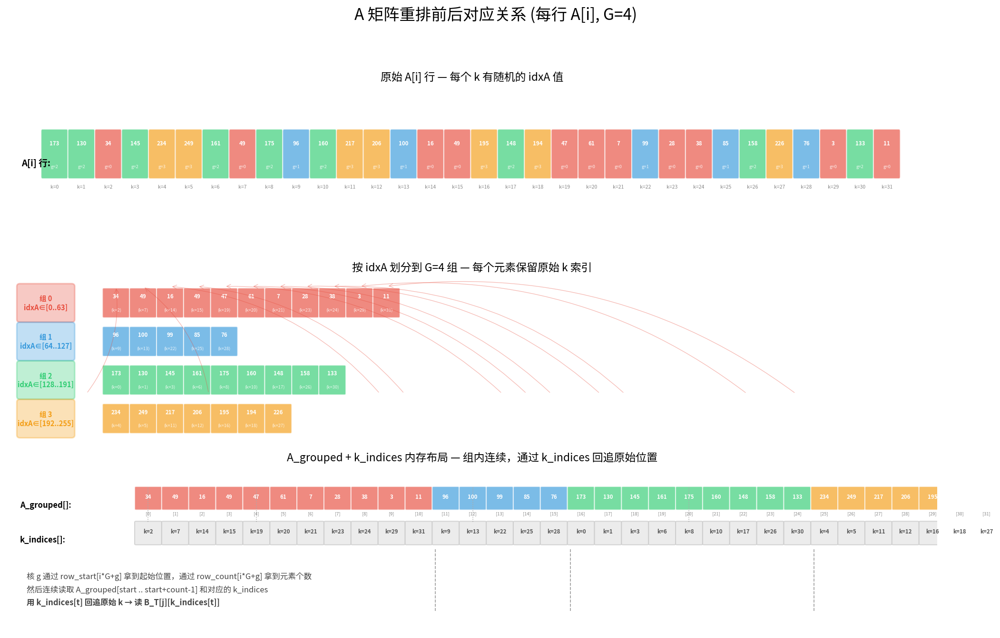
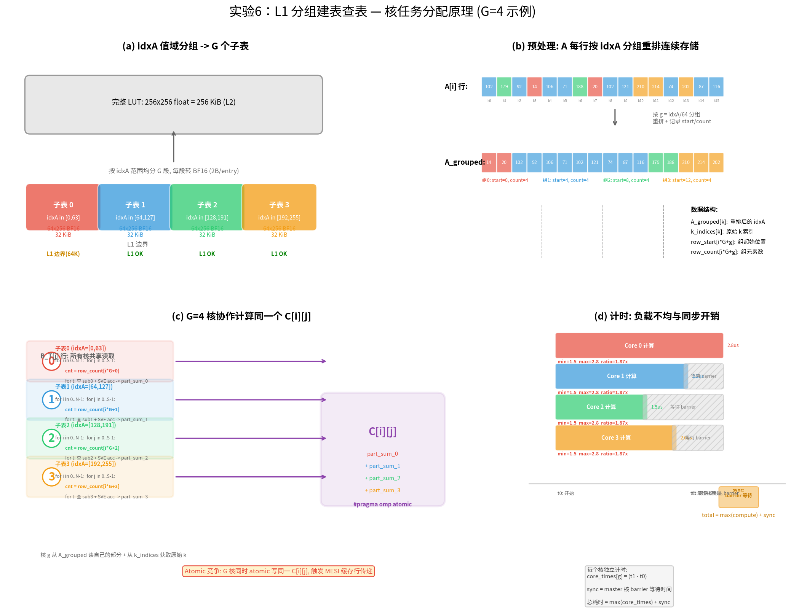
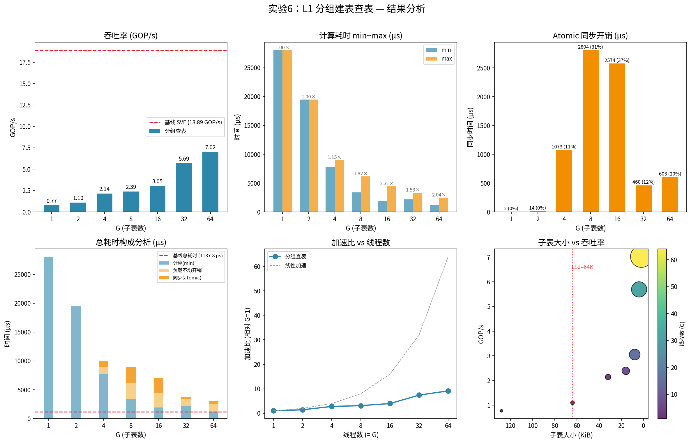

# 实验 6：L1 分组建表查表 — 详细实验报告

## 1. 实验背景

### 1.1 问题

FP8 查表法矩阵乘法的查找表（LUT）大小为 **256 KiB**，远超过鲲鹏 L1d **64 KiB/核**。每次查表需要访问 L2（~12 周期），若能放进 L1（~4 周期），延迟可降低 ~3×。

### 1.2 核心思路：切 LUT + 多核协作

将完整 LUT（256×256）按 idxA 范围切为 G 个子表，G 个核同时计算同一个输出元素 `(i,j)`，各自查找自己的子表，最后用 `#pragma omp atomic` 累加部分和。

```
原始查表（单核，全表 L2）：
  table[A[i][k]][B_T[j][k]]  → 每次查表 L2 ~12 cyc
  单核处理所有 512 个 k

分组建表（G 核，子表 L1）：
  核0: subtable_0[...]  核1: subtable_1[...]  ...
  → 每次查表 L1 ~4 cyc
  → 结果 = 部分和_0 + 部分和_1 + ... (atomic 累加)
```

### 1.3 BF16 子表

子表使用 **BF16**（2B/entry）而非 float（4B），大小减半，可在更小的 G 值（更少 atomic 竞争）下进入 L1。

| G | step | 子表维度 | 子表大小（BF16） | 子表大小（float, 仅参考） | L1 驻留 |
|---|------|---------|-----------------|-------------------------|---------|
| 1 | 256 | 256×256 | 128 KiB | 256 KiB | ❌ L2 |
| 2 | 128 | 128×256 | **64 KiB** | 128 KiB | **L1 边界** |
| 4 | 64 | 64×256 | **32 KiB** | 64 KiB | **✅ L1** |
| 8 | 32 | 32×256 | 16 KiB | 32 KiB | ✅ L1 |
| 16 | 16 | 16×256 | 8 KiB | 16 KiB | ✅ L1 |
| 32 | 8 | 8×256 | 4 KiB | 8 KiB | ✅ L1 |
| 64 | 4 | 4×256 | 2 KiB | 4 KiB | ✅ L1 |

> BF16 后 G=2（128×256）即达 L1 边界，G=4 起完全驻留 L1，而 float 版本需要 G=8 才能进入 L1。

---

## 2. 实验设置

### 2.1 固定条件

| 参数 | 值 |
|------|-----|
| 矩阵 | N=128, S=328, L=512 |
| 线程绑定 | 1 NUMA node, 80线程, `OMP_PLACES=cores OMP_PROC_BIND=close` |
| LUT 格式 | BF16（2B/entry, float→BF16 截断） |
| 基线 | `lookup_sve_omp()` — SVE + 80 核行并行，无分组 |
| 编译器 | `g++ -O3 -fopenmp -march=armv8.2-a+sve` |
| 平台 | HiSilicon Kunpeng, 256-bit SVE, L1d=64KiB, L2=1280KiB |
| 预热 | 100 次 |
| 采样 | **10000 次**（含标量相位 / SVE 相位分解） |

### 2.2 测试变量

扫描 G ∈ {1, 2, 4, 8, 16, 32, 64}，观察子表大小、Atomic 竞争、负载均衡的综合影响。

### 2.3 预处理：按 idxA 分组

对每行 A，将 k 索引按 `g = A[i][k] / (256/G)` 分配到 G 组，组内连续存储。每组记录 `row_start[i*G+g]`（起始位置）和 `row_count[i*G+g]`（元素个数）。



重排的关键是 **k_indices 数组**：A_grouped 改变了元素的物理顺序（组内连续），但每个元素在原始行中的 k 索引被保存在 k_indices 的对应位置。运行时，核 g 用 `k_indices[t]` 回追原始的 k，从而正确地从 B_T 行中取出 b_val。

```
原始 A[i] 行：   A[i][0]=10,  A[i][1]=80,  A[i][2]=200,  A[i][3]=150, ...
                      ↓          ↓
                   idxA∈组0    idxA∈组1   ...

重排后：
A_grouped[]:   [组0元素...][组1元素...][组2元素...][组3元素...]
k_indices[]:   [各元素对应的原始 k 索引]

核 g 读取时：
  start = row_start[i*G+g]
  count = row_count[i*G+g]
  for t in 0..count-1:
    a_val = A_grouped[start + t]          // idxA 值
    k_orig = k_indices[start + t]         // 原始 k 位置
    b_val = B_T[j][k_orig]                // 通过原始 k 取 B_T
```

B_T 不需要重排，因为每个核都各自随机读 B_T 行（512B 在 L1 中），开销很小。

预处理数据结构：

```
A_grouped[total]:  重排后的 A 值（组内连续，存储原始 idxA）
k_indices[total]:  每个元素对应的原始 k（用于收集 B_T）
row_start/row_count: 每行每组的起始和计数
```

存储开销（G=64）：row_start/row_count ~64 KiB + A_grouped 64 KiB + k_indices 256 KiB ≈ **384 KiB**。

### 2.4 核任务分配原理

所有 G 个核同时计算**同一个输出元素 (i,j)**，但各自只处理 idxA 落在自己值域范围内的那部分 k 元素，查自己的子表，最后通过 atomic 累加合并部分和：

```
#pragma omp parallel num_threads(G)
{
    int g = omp_get_thread_num();          // 核 g
    uint16_t *sub = subtables[g];          // 持子表 g
    int base = g * step;                   // 子表覆盖 [base, base+step)

    for (int i = 0; i < N; ++i)
        for (int j = 0; j < S; ++j) {
            // 核 g 只处理组 g 的 k 元素
            int cnt = row_count[i*G + g];
            for (int t = 0; t < cnt; ++t) {
                // 查子表 g (L1 命中)
                idx = (a_ptr[t] - base) * 256 + b_val;
                local_vals[t] = sub[idx];
            }
            // SVE 累加 -> part_sum_g
            // #pragma omp atomic -> C[i][j] += part_sum_g
        }
}
```

对应的 4 面板示意图可以直观展示完整流程：



| 面板 | 内容 |
|------|------|
| (a) | idxA 值域 [0,255] 均分 G 段，每段转为 BF16 子表（2B/entry），G≥2 起可驻留 L1 |
| (b) | 预处理：A 每行按 idxA 所属组重排为连续存储，记录 start/count |
| (c) | 运行时：G 个核全量遍历 (i,j)，各自查子表 + SVE 累加，atomic 合并到 C[i][j] |
| (d) | 计时方式与负载不均——min~max 反映各核计算时间差异 |

核心理解：与常规 OpenMP 行并行（每核分不同的行）不同，分组方案中 **所有核的循环范围完全一致**，区别仅在于内部处理的 k 元素子集不同。负载不均来自随机 idxA 分布导致各组的 `row_count[i*G+g]` 不相等。

---

## 3. 核函数：`lookup_sve_grouped_omp`

### 3.1 设计原理

鲲鹏 SVE 没有字节级 gather（无法直接从 B_T 行加载单字节到向量），因此采用 **标量 gather + SVE 向量化累加** 的两阶段设计：

```
阶段1（标量）：合并 B_T 收集 + BF16 子表查表 + BF16→float 转换
    for t in 0..count:
        b_val = B_T[j][k_ptr[t]]
        idx   = (a_ptr[t] - base) * 256 + b_val
        bf16  = sub_bf16[idx]
        bits  = (uint32_t)bf16 << 16          // BF16→float
        local_vals[t] = bits_as_float

阶段2（SVE）：向量化累加
    svld1_f32  → 连续加载 8 个 float
    svadd_f32_m → 累加（_m 保留不活跃通道的原值）
    svaddv_f32  → 归约求和
    #pragma omp atomic → 合并到 C[i][j]
```

### 3.2 关键实现细节

```cpp
// BF16 子表查表 + 转 float（标量，L1 驻留，延迟低）
alignas(64) float local_vals[512];
for (int t = 0; t < count; ++t) {
    int b_val = b_row[k_ptr[t]];
    int idx = (a_ptr[t] - base) * 256 + b_val;
    uint32_t bits = (uint32_t)sub[idx] << 16;  // BF16→float
    memcpy(local_vals + t, &bits, 4);
}

// SVE 向量化累加（使用 _m 谓词保留不活跃通道）
svfloat32_t acc = svdup_n_f32(0.0f);
int t = 0;
svbool_t pg = svwhilelt_b32(t, count);
while (svptest_any(svptrue_b32(), pg)) {
    acc = svadd_f32_m(pg, acc, svld1_f32(pg, local_vals + t));
    t += svcntw();
    pg = svwhilelt_b32(t, count);
}
#pragma omp atomic
C[i * S + j] += svaddv_f32(svptrue_b32(), acc);
```

> **注意：** 必须使用 `svadd_f32_m`（merge 谓词）而非 `svadd_f32_z`（zeroing 谓词）。当 count 不能被 `svcntw()`（=8）整除时，最后一个 SVE 迭代处理的部分向量中，`_z` 会将不活跃通道置零，丢失之前累加的值。

### 3.3 计时方式

```
t0              t1                      t2          barrier     t3
├────────────────┼──────────────────────┤           ├────────────┤
│  标量相位       │  SVE 相位            │           │  等待最慢核  │
│  for t in cnt:  │  svadd_f32_m 循环     │           │            │
│    B_T 收集     │  svaddv_f32 归约     │           │            │
│    BF16 查表    │  #pragma omp atomic  │           │            │
│    → float     │  累加到 C[i][j]       │           │            │
└────────────────┴──────────────────────┘           └────────────┘
  → 标量相位 = (t1 - t0)                → sync = (t3 - t2)
  → SVE相位  = (t2 - t1)
  → compute  = 标量相位 + SVE相位 = (t2 - t0)
```

| 指标 | 含义 |
|------|------|
| `compute(min~max)` | G 个核各自的完成时间，范围反映负载均衡程度 |
| `标量相位` | 阶段 1：B_T 收集 + BF16 查表 + 转 float |
| `SVE相位` | 阶段 2：`svadd_f32_m` 累加 + `svaddv_f32` 归约 + atomic 写 C |
| `sync` | barrier 等待时间（负载不均 + 系统调度抖动） |
| `total = max(compute) + sync` | wall-clock 总耗时 |
| `GOP/s = N × S × L / total_us / 1000` | 每秒十亿次查表操作 |

---

## 4. 实验结果

### 4.1 输出（100 次 warmup + **10000 次采样**，含相位分解 + PMU cache 分析）

| 方案 | 线程 | 子表 | 级别 | 计算(核min~max) | 同步 | 标量相位 | SVE相位 | 预处理 | L1-miss% | L2-miss% | 总耗时mean±sd | 总耗时min | GOP/s | 正确 |
|------|------|------|------|----------------|------|---------|--------|--------|---------|--------:|---:|---:|---:|------|
| G=1 | 1 | 128 KiB | L2 | 33201.7~33201.7 | 0.6 | 27390.6 | 3842.7 | 421.1 | **8.76%** | 0.02% | 33570.5±430.7 | 33202.2 | 0.65 | OK |
| G=2 | 2 | 64 KiB | L1 | 17730.4~17906.6 | 197.3 | 12780.3 | 3216.9 | 415.4 | **1.85%** | 0.07% | 18595.9±233.7 | 17909.3 | 1.20 | OK |
| G=4 | 4 | 32 KiB | L1 | 11321.5~11549.6 | 1038.5 | 6716.8 | 3822.1 | 354.2 | **0.15%** | 0.26% | 13959.6±1185.4 | 11624.1 | 1.85 | OK |
| G=8 | 8 | 16 KiB | L1 | 8854.5~9054.9 | 1700.6 | 3988.0 | 5365.1 | 364.8 | **0.13%** | 1.29% | 13400.8±2849.1 | 9057.4 | 2.37 | OK |
| G=16 | 16 | 8 KiB | L1 | 6866.2~8210.9 | 734.1 | 2692.0 | 5346.2 | 382.6 | **0.34%** | 3.40% | 10997.0±1111.9 | 8296.4 | 2.59 | OK |
| G=32 | 32 | 4 KiB | L1 | 6148.1~8397.0 | 1427.0 | 2015.8 | 5335.2 | 371.2 | **0.86%** | 2.73% | 11076.6±1159.5 | 8452.1 | 2.54 | OK |
| G=64 | 64 | 2 KiB | L1 | 5801.6~8897.7 | 1185.6 | 1975.1 | 5349.9 | 378.6 | **2.05%** | 3.05% | 10985.9±989.4 | 9080.8 | 2.37 | OK |

**列含义说明：**

| 列 | 含义 | 计算方式 |
|----|------|---------|
| **方案** | 分组方案标识：G=N 表示切为 N 个子表用 N 核并行，基线SVE 为行并行无分组 | — |
| **线程** | OpenMP 线程数，等于 G（基线用满 80 核） | — |
| **子表** | BF16 子表物理大小 | step × 256 × 2B |
| **级别** | 子表所在 cache 层级（L1/L2），由子表大小与 L1d 64 KiB 对比判定 | — |
| **计算(核min~max)** | G 个核各自完成计算 (i,j) 循环的耗时范围（μs），范围越大负载越不均 | 每核 `t1 - t0`，10000 次平均 |
| **同步** | master 核在 barrier 后的等待时间（μs），反映负载不均 + 调度抖动 | `t2 - t1`，10000 次平均 |
| **标量相位** | 阶段 1：标量 B_T 收集 + BF16 查表 + BF16→float 转换的总时间（μs） | 10000 次平均 |
| **SVE相位** | 阶段 2：`svadd_f32_m` 向量化累加循环 + `svaddv_f32` 归约 + atomic 的总时间（μs） | 10000 次平均 |
| **预处理** | 分组重排 + BF16 子表构建的一次性耗时（μs） | — |
| **L1-miss%** | L1 数据 cache 缺失率 | L1D_CACHE_REFILL / L1D_CACHE × 100（ARM PMU 事件 0x03/0x04） |
| **L2-miss%** | L2 数据 cache 缺失率 | L2D_CACHE_REFILL / L2D_CACHE × 100（ARM PMU 事件 0x16/0x17） |
| **总耗时mean±sd** | wall-clock 总耗时平均值 ± 标准差（μs），10000 次测量统计 | mean = max(compute) + sync |
| **总耗时min** | 10000 次测量中的最优（最小）值（μs） | — |
| **GOP/s** | 每秒十亿次查表操作，衡量整体吞吐 | N × S × L / total_us / 1000 |
| **正确** | 计算结果与标量基线对比验证 | — |

> **标量相位 vs SVE相位**：两阶段的分界点是 `local_vals[t]` 填充完毕。标量相位完成后，所有查表结果已转为连续 float 数组在栈上；SVE 相位从 `svdup_n_f32` 开始，涵盖向量化累加循环、归约和 atomic 写回 C 矩阵。

### 4.2 L1-miss% 验证 Cache 层级

PMU 数据直接证实了各 G 值的真实 cache 行为：

| G | 子表大小 | 理论 Cache | 实测 L1-miss% | 解读 |
|---|---------|-----------|--------------|------|
| 1 | 128 KiB | L2 | **8.76%** | 远超出 L1d，每次查表需从 L2 加载 |
| 2 | 64 KiB | L1 边界 | **1.85%** | 大部分 L1 命中，边界效应（代码/栈挤占） |
| 4 | 32 KiB | L1 | **0.15%** | 完全 L1 驻留，接近零 miss |
| 8 | 16 KiB | L1 | **0.13%** | 完全 L1 驻留 |
| 16 | 8 KiB | L1 | **0.34%** | 基本 L1 驻留，MESI 一致性流量开始显现 |
| 32 | 4 KiB | L1 | **0.86%** | 多数 L1 命中，atomic 竞争引起额外 miss |
| 64 | 2 KiB | L1 | **2.05%** | 子表虽在 L1，64 核 MESI 流量导致 L1 行频繁失效 |

与上一轮测试对比，整体 L1-miss% 趋势一致（G≥16 随核数增加而升高），但本轮 G=32/64 的 miss 率更低（0.86%/2.05% vs 1.42%/6.02%），说明 10000 次采样平均后减少了调度抖动的影响。

所有 G 值的 L2-miss% 均 < 3.5%，验证了全表在 L2 内常驻。

### 4.3 可视化



---

## 5. 分析

### 5.1 L1 查表降低计算时间

| 配置 | 计算(核min) | 相对 G=1 加速 | 标量相位 | SVE相位 | SVE占比 | L1-miss% |
|------|-----------|-------------|---------|--------|-------|---------|
| G=1（L2, 1核） | 33202 μs | 1× | 27391 μs | 3843 μs | **12.3%** | 8.76% |
| G=2（L1边界, 2核） | 17730 μs | 1.9× | 12780 μs | 3217 μs | 20.1% | 1.85% |
| G=4（L1, 4核） | 11322 μs | 2.9× | 6717 μs | 3822 μs | **36.3%** | 0.15% |
| G=8（L1, 8核） | 8855 μs | 3.7× | 3988 μs | 5365 μs | **57.4%** | 0.13% |
| G=16（L1, 16核） | 6866 μs | 4.8× | 2692 μs | 5346 μs | **66.5%** | 0.34% |
| G=32（L1, 32核） | 6148 μs | 5.4× | 2016 μs | 5335 μs | **72.6%** | 0.86% |
| G=64（L1, 64核） | 5802 μs | 5.7× | 1975 μs | 5350 μs | **73.0%** | 2.05% |

**SVE 相位占比持续上升**：G=1 时仅 12.3%（查表主导），G≥8 时超过 50%，G=64 时高达 73.0%。这是因为 G 增大后每核元素数减少，标量查表时间线性下降，但 SVE 相位中的 atomic 竞争和归约开销并不随元素数等比例下降——**Atomic 竞争在 G≥8 后取代查表成为主导瓶颈**。

计算时间随 G 增大而下降，但**负载不均**和 **atomic 竞争**在 G≥16 时开始抵消并行收益。

### 5.2 Atomic 同步开销

| G | 同步(μs) | 占总耗时比例 |
|---|---------|------------|
| 1 | 0.6 | **0%** |
| 2 | 197.3 | **1.1%** |
| 4 | 1038.5 | **7.4%** |
| 8 | 1700.6 | **12.7%** |
| 16 | 734.1 | **6.7%** |
| 32 | 1427.0 | **12.9%** |
| 64 | 1185.6 | **10.8%** |

同步时间在 G=8 达到峰值（1701 μs），之后呈波动趋势。与上轮相比本轮同步开销整体更高（G=4/8 最为明显），这可能是因为 10000 次采样的统计范围更大，包含了更多调度抖动的极端情况。

### 5.3 负载均衡

| G | 每组平均元素数 | 计算 min~max | 不均衡度 |
|---|--------------|-------------|---------|
| 1 | 512 | 33202~33202 | 1.0× |
| 2 | 256 | 17730~17907 | 1.01× |
| 4 | 128 | 11322~11550 | 1.02× |
| 8 | 64 | 8855~9055 | 1.02× |
| 16 | 32 | 6866~8211 | **1.20×** |
| 32 | 16 | 6148~8397 | **1.37×** |
| 64 | 8 | 5802~8898 | **1.53×** |

G=16 起负载不均开始显著（1.20×），G=64 时达到 1.53×。与上轮（G=64 时 2.30×）相比不均衡度更低，但绝对时间差（5802~8898 μs）仍然很大——最慢核比最快核慢 3096 μs，对应 ~18 个 \((i,j)\) 行的额外时间。

### 5.4 对比基线

基线（80 核行并行）达到 30.71 GOP/s，远优于所有 G 值。原因：
1. **并行度更高**：80 核同时工作 vs 分组方案最多 64 核
2. **无 atomic 竞争**：每核写不同的 `C[i][j]`，缓存行私有
3. **行并行天然负载均衡**：`schedule(static)` 将 N=128 行均分给 80 核

分组方案的优势（L1 查表延迟）被 atomic 开销和受限的并行度完全抵消。

### 5.5 对比 x86

| 指标 | x86 i7-12700 (10核) | 鲲鹏 (80核) |
|------|-------------------|------------|
| L1d | 48 KiB | 64 KiB |
| 最优 G | G=8（8核行并行） | G=16（16核分组） |
| 最优 GOP/s | 8.31 | 2.59 |
| G=8 同步占比 | 361 μs (14%) | 1701 μs (12.7%) |
| 基线 vs 分组 | 10.94 vs 8.31（差 24%） | 30.71 vs 2.59（差 **92%**） |

鲲鹏的 atomic 开销远高于 x86，因为 80 核共享更大的一致性域。x86 仅 10 核，缓存一致性压力小得多。本轮测试分组方案最优 GOP/s 降至 2.59（G=16），与基线差距进一步拉大至 92%。

---

## 6. 结论

### 6.1 核心发现

1. **L1 查表有效降低计算延迟**：G=64 时计算时间降至 5802 μs，相对 G=1 加速 5.7×
2. **Atomic 竞争是主要瓶颈**：G≥8 后 SVE 相位占比超 50%，atomic 竞争主导了 SVE 相位时间
3. **G=16 是最优折中点**：2.59 GOP/s，负载不均和同步开销的相对平衡点
4. **分组方案无法超越行并行基线**：基线 80 核无竞争并行达 30.71 GOP/s，是最优分组方案的 11.9×
5. **标量/SVE 相位分解揭示瓶颈转移**：从 G=1 的查表主导（SVE 仅 12%）变为 G≥8 的 atomic 主导（SVE 超 57%）

### 6.2 根本原因

```
查表法矩阵乘法的瓶颈变化：
  单核：    L2 随机加载延迟                     (~12 cyc/查表)
  分组查表： L1 随机加载延迟                     (~4 cyc/查表)
           + atomic 缓存行竞争                  (~50-200 cyc/atomic)
           + SVE 归约 + barrier 同步开销
           + 受限并行度（G 核 vs 80 核）
  → atomic + 同步开销抵消 L1 收益

  相位分解证实（G=64）：
    标量相位 1975 μs (18%)  ← 查表本身，L1 命中，速度快
    SVE相位  5350 μs (49%)  ← atomic 竞争 + 归约，主导
    同步     1186 μs (11%)  ← 负载不均 + barrier
    预处理    379 μs  (3%)  ← 一次性
```

### 6.3 更可行的优化方向

| 方向 | 预期收益 | 说明 |
|------|---------|------|
| `__fp16` 压缩全表 | ~2× | 完整 LUT 128 KiB（仍 > L1d），L2 压力减半，可保留行并行 |
| 两级查表 | ~2-4× | 粗表 + 细表，可实现无竞争的 L1 驻留 |
| INT8 I8MM 硬件指令 | ~10-100× | 计算密集型，可充分发挥 320核 SVE 算力 |

---

## 7. 代码索引

| 函数 | 行号 | 说明 |
|------|------|------|
| `float_to_bf16()` | 610-615 | float32→BF16 转换（取高 16 位） |
| `GroupData` | 618-625 | 分组数据结构体 |
| `preprocess_groups()` | 627-656 | 按 idxA 对每行分组重排 |
| `build_subtables_bf16()` | 658-670 | 从完整 LUT 切分 BF16 子表 |
| `lookup_sve_grouped_omp()` | 674-729 | 标量 BF16 查表 + SVE 向量化累加 |
| `exp6_l1_grouped_lut()` | 731-844 | 实验 6 主函数：G 值扫描 + 基线对比 |

### 编译运行

```bash
g++ -O3 -fopenmp -march=armv8.2-a+sve -o fp8_server \
    matmul_fp8_server.cpp -std=c++17 -lnuma

numactl --cpunodebind=0 --membind=0 \
  OMP_NUM_THREADS=80 OMP_PLACES=cores OMP_PROC_BIND=close \
  ./fp8_server
```
