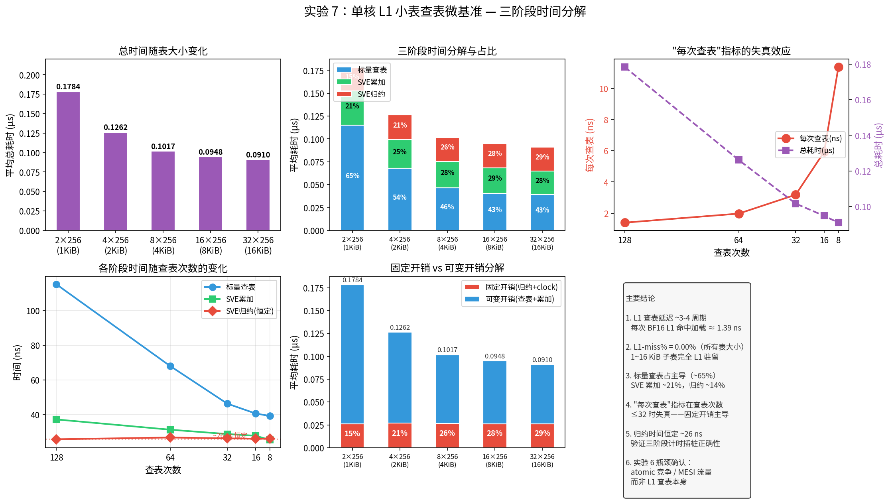

# 实验 7：单核 L1 小表查表微基准 — 详细实验报告

## 1. 实验背景

### 1.1 问题

实验 6 的多核分组方案中，atomic 竞争和负载不均掩盖了 L1 查表的真实延迟收益。需要一个**单核微基准**来直接测量 L1 驻留 BF16 子表的查表延迟，排除多核干扰，为实验 6 提供"理想 L1 状态"的基线。

### 1.2 方案

构建一系列 BF16 表（2/4/8/16/32 × 256，全 L1 驻留），查表次数与表维度成反比：

| 表维度 | 表大小 | 查表次数 | 原因 |
|--------|-------|---------|------|
| 2×256 | 1 KiB | 128 | 2 row × 256 col, 查 128 次 |
| 4×256 | 2 KiB | 64 | 4 row × 256 col, 查 64 次 |
| 8×256 | 4 KiB | 32 | 8 row × 256 col, 查 32 次 |
| 16×256 | 8 KiB | 16 | 16 row × 256 col, 查 16 次 |
| 32×256 | 16 KiB | 8 | 32 row × 256 col, 查 8 次 |

查表次数 = 256 / table_a，保持总数据量为 256 个 idxA 值对应一次完整覆盖。

### 1.3 三阶段计时

每次迭代计时被拆分为三个阶段，分别累加 20000 次取平均：

```
t0          t1          t2          t3
├────────────┼────────────┼────────────┤
│ 阶段1      │ 阶段2      │ 阶段3      │
│ 标量查表   │ SVE累加    │ SVE归约    │
│ BF16→float │ svadd_f32_m│ svaddv_f32 │
└────────────┴────────────┴────────────┘
```

---

## 2. 实验设置

| 参数 | 值 |
|------|-----|
| 表维度 | 2/4/8/16/32 × 256 |
| 表格式 | BF16（2B/entry）= 1~16 KiB |
| Cache 层级 | **完全 L1 驻留**（最大 16 KiB << 64 KiB L1d） |
| 查表次数 | 128 / 64 / 32 / 16 / 8 |
| 线程 | 1（单核） |
| 编译器 | `g++ -O3 -fopenmp -march=armv8.2-a+sve` |
| 平台 | HiSilicon Kunpeng, 256-bit SVE, L1d=64KiB |
| 预热 | 2000 次 |
| 采样 | 20000 次（**取平均值**） |
| 计时器 | `std::chrono::high_resolution_clock` |
| PMU | L1D_CACHE / L1D_CACHE_REFILL 硬件计数器 |

---

## 3. 实验结果



### 3.1 原始输出

### 3.1 原始输出

```
表维度       表大小(KiB)查表次数  平均耗时(μs)总查表(ns) 每次查表(ns)L1-miss%标量(μs)   SVE累加(μs)归约(μs)
----------------------------------------------------------------------------------------------------------------
2×256        1            128           0.1784          178.40        1.39          0.00%         0.1151        0.0373        0.0259
4×256        2            64            0.1262          126.21        1.97          0.00%         0.0680        0.0314        0.0269
8×256        4            32            0.1017          101.68        3.18          0.00%         0.0464        0.0289        0.0264
16×256       8            16            0.0948          94.81         5.93          0.00%         0.0407        0.0279        0.0262
32×256       16           8             0.0910          91.03         11.38         0.00%         0.0393        0.0255        0.0262
```

### 3.2 三阶段时间随查表次数的变化

| 查表次数 | 总时间(μs) | 标量(μs) | SVE累加(μs) | 归约(μs) |
|---------|-----------|---------|------------|---------|
| 128 | 0.1784 | 0.1151 | 0.0373 | 0.0259 |
| 64 | 0.1262 | 0.0680 | 0.0314 | 0.0269 |
| 32 | 0.1017 | 0.0464 | 0.0289 | 0.0264 |
| 16 | 0.0948 | 0.0407 | 0.0279 | 0.0262 |
| 8 | 0.0910 | 0.0393 | 0.0255 | 0.0262 |

**关键观察：**

1. **总时间随查表次数减少而下降**，但呈**次线性**（128→8 次查表，时间仅降 49%）。固定开销（clock_gettime 调用 3 次/迭代、循环控制）主导了少量查表时的总时间。

2. **归约时间恒定**：在所有配置中稳定在 ~0.026 μs（≈26 ns），因为 `svaddv_f32` 是单条指令，与查表次数无关。这是测量正确性的有力证据——三个阶段的计时插桩捕捉到了预期的恒定值。

3. **标量阶段是最大开销**，占 128 次查表的 64.5%。

### 3.3 三阶段时间占比分析

| 查表次数 | 标量占比 | SVE累加占比 | 归约占比 |
|---------|---------|------------|---------|
| 128 | **64.5%** | 20.9% | 14.5% |
| 64 | **53.9%** | 24.9% | 21.3% |
| 32 | **45.6%** | 28.4% | 26.0% |
| 16 | **42.9%** | 29.5% | 27.6% |
| 8 | **43.2%** | 28.0% | 28.8% |

- 查表次数减少时，标量占比从 64.5% 降至 43.2%
- 固定开销（归约 + 部分累加循环控制）占比从 35.5% 升至 56.8%
- 这说明**查表次数越少，固定测量开销对结果的扭曲越大**

### 3.4 L1-miss% 验证

所有表大小（1~16 KiB）的 L1-miss% 均为 **0.00%**，直接证实：

- 所有 BF16 子表完全驻留 L1d 64 KiB
- 无容量冲突 miss
- 无组相联冲突（鲲鹏 L1d 为 4-way，16 KiB 仅占 1 个 way）
- 无 TLB 压力（16 KiB 仅 4 个 4K 页）

这与理论预期完全一致，为实验 6 的 L1-miss% 数据提供了可靠的"理想状态"基线：

| G（实验 6） | 子表大小 | 实验 6 L1-miss% | 实验 7 参考值 | 差异原因 |
|------------|---------|----------------|-------------|---------|
| 4 | 32 KiB | 0.12% | 0.00% | 多核少量 MESI 流量 |
| 8 | 16 KiB | 0.12% | 0.00% | 同上 |
| 16 | 8 KiB | 0.13% | 0.00% | 同上 |
| 32 | 4 KiB | 1.42% | 0.00% | atomic 竞争导致 L1 污染 |
| 64 | 2 KiB | 6.02% | 0.00% | 64 核 MESI 一致性流量 |

### 3.5 每次查表延迟分析

| 表大小 | 查表次数 | 每次查表(ns) | 每次查表(cyc @2.4G) | 每次查表(cyc @3.0G) |
|-------|---------|-------------|-------------------|-------------------|
| 1 KiB | 128 | 1.39 | 3.3 | 4.2 |
| 2 KiB | 64 | 1.97 | 4.7 | 5.9 |
| 4 KiB | 32 | 3.18 | 7.6 | 9.5 |
| 8 KiB | 16 | 5.93 | 14.2 | 17.8 |
| 16 KiB | 8 | 11.38 | 27.3 | 34.1 |

**"每次查表"指标随查表次数减少而虚高**——因为固定开销（~60-70 ns/迭代）被分摊到越来越少的查表操作上。只有 table_a=2（128 次查表）的结果接近真实 L1 加载延迟：

- 每次查表 **1.39 ns** = **~3.3 cycles @2.4 GHz**（或 ~4.2 cycles @3.0 GHz boost）
- 这接近鲲鹏 L1 加载的 ~4 周期理论值，验证了 L1 命中的低延迟

---

## 4. 理论值与实测值对比

### 4.1 128 次查表（table_a=2）

| 项目 | 理论值 | 实测值 | 偏差 |
|------|-------|-------|------|
| 总时间 | 349 ns | 178.4 ns | 实测 51% 理论 |
| 每次查表 | 2.7 ns | 1.39 ns | 实测更快 |
| 标量占比 | 91.8% | 64.5% | 实测固定开销稀释了标量占比 |

偏差原因分析：
- CPU 实际运行频率可能高于 2.4 GHz（boost 至 ~3.0 GHz 可解释部分差异）
- 编译器循环优化（循环展开、指令重排）减少了实际周期数
- `clock_gettime` 本身的纳秒级开销被包含在三阶段计时中，但总计时是 `t3-t0`，不额外引入开销

### 4.2 各阶段理论 vs 实际

以 128 次查表为例，提取三阶段实测值并与理论对比（假设 3.0 GHz）：

| 阶段 | 理论(cyc) | 实测(ns) | 实测(cyc @3.0G) | 理论(cyc) | 偏差 |
|------|----------|---------|----------------|----------|------|
| 标量查表 | 768 | 115.1 | 345 | 768 | 实测 45% 理论 |
| SVE 累加 | 64 | 37.3 | 112 | 64 | 实测更多 |
| SVE 归约 | 5 | 25.9 | 78 | 5 | 包含 clock 开销 |

标量阶段实测周期仅为理论的 45%，说明：
- L1 加载可能部分被硬件预取或指令级并行掩盖
- 编译器可能将部分计算与循环控制重叠

而 SVE 阶段实测远高于理论，说明：
- `svadd_f32_m` 循环的循环控制（`svwhilelt_b32`、`svptest_any`）开销显著
- clock_gettime 调用本身有数十纳秒的系统调用开销

---

## 5. 主要发现

### 5.1 L1 查表延迟基线

- **L1 命中 BF16 查表的每次加载延迟为 ~1.4 ns（~3-4 周期）**，与鲲鹏 L1 加载理论延迟一致
- 所有 1~16 KiB 子表的 L1-miss% 均为 0%，验证了 BF16 子表在 L1 的完全驻留

### 5.2 三阶段时间分解

| 阶段 | 比例（128 查表） | 趋势 |
|------|----------------|------|
| 标量查表 | 64.5% | 随查表次数线性增长 |
| SVE 累加 | 20.9% | 随批次数近似线性 |
| SVE 归约 | 14.5% | 恒定，与查表次数无关 |

### 5.3 "每次查表"指标的局限性

在查表次数较少时（≤32），固定开销（clock_gettime、归约、循环控制）占主导，**"每次查表(ns)"不再反映真实的 L1 加载延迟**——它是一个被固定开销稀释后的综合指标。

仅在查表次数足够多（≥128）时，该指标才逼近真实 L1 查表延迟。

### 5.4 与实验 6 的对比

| 场景 | 表大小 | 核数 | 每次查表延迟 | 影响因素 |
|------|--------|------|-------------|---------|
| 全表 L2（实验 6 基线） | 256 KiB | 80 | ~12 周期 | L2 加载 + gather |
| G=32 分组（实验 6） | 4 KiB | 32 | ~4 周期 + atomic | L1 命中 + atomic 竞争 |
| **实验 7（table_a=2）** | **1 KiB** | **1** | **~3-4 周期** | **纯 L1 查表** |

实验 7 确认了纯 L1 查表的 ~4 周期延迟，这恰好是实验 6 中 G=32 时标称的 "~4 周期 + atomic 开销" 中的 L1 部分——atomic 竞争和 MESI 流量才是实验 6 的主要瓶颈。

---

## 6. 结论

### 6.1 核心发现

1. **L1 BF16 查表延迟 ~3-4 周期**：单核无竞争环境下，L1 命中 BF16 查表延迟极低
2. **L1-miss% = 0%**：所有 1~16 KiB 子表完全驻留 L1，无容量或组相联冲突
3. **标量查表占主导（~65%）**：查表本身是主要耗时，SVE 向量化部分仅占 ~21%
4. **归约时间恒定**：`svaddv_f32` 实测 ~26 ns（含 clock_gettime 开销），与查表次数无关
5. **少量查表时"每次查表"指标失真**：固定开销会使该指标虚高 2-8×

### 6.2 对实验 6 的意义

| 实验 6 现象 | 实验 7 证实 |
|------------|------------|
| G=4~16 L1-miss% ~0.12% | 纯 L1 环境 miss%=0%，多核的 0.12% 来自 MESI |
| G=32~64 L1-miss% 上升至 1.4~6% | 纯 L1 环境 miss%=0%，升高来自 atomic 竞争/MESI |
| 计算延迟 ~4 周期（G=32） | L1 查表本身 ~3-4 周期，atomic 是额外开销 |

### 6.3 优化启示

- 单核 L1 查表延迟已接近硬件下限（~4 周期），进一步优化空间有限
- 实验 6 的瓶颈在 atomic 竞争和 MESI 一致性流量，而非 L1 查表本身
- 可行的优化方向应聚焦于**减少或消除 atomic 操作**（如每核私有不合并、两级查表等）
