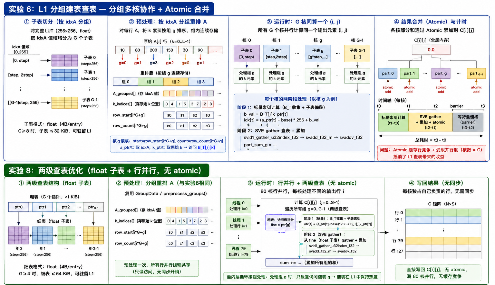

# 实验结果汇总

## 1. 固定参数

| 参数 | 值 |
|------|-----|
| N (行) | 128 |
| L (K维) | 512 |
| S (列) | 328 |
| LUT 格式 | float (4B/entry, 256×256 = 256 KiB) |
| 循环次数 (loopCnt) | 10,000 (预热 100 次) |
| 编译器 | `g++ -O3 -fopenmp -march=armv8.2-a+sve+fp16+i8mm` |
| 平台 | HiSilicon Kunpeng 920, 256-bit SVE, L1d=64KiB, L2=1280KiB |
| 总 (i,j) 对数 | 128 × 328 = **41,984** |
| 标准 MAC 操作 (N×S×L) | **21,495,808** |

**GOP/s 公式**（统一标准）：

```
GOP/s = N × S × L / total_time_us / 1000
```

使用标准矩阵乘法的 MAC 计数（每次乘加 = 1 MAC），查表法和直接乘法均使用此公式。

## 2. 单核测试结果（全部为 10000 次测量均值）

### 2.1 数据表

| # | 方案 | 数据源 | 时间(μs) | L1-miss% | L2-miss% | 计算指令(M) | 访存指令(M) | **GOP/s** | vs FP8 SVE | 任务描述 |
|:-:|:----|:------:|:--------:|:--------:|:--------:|:----------:|:----------:|:---------:|:----------:|:---------|
| 1 | FP8 标量查表 | **实测** | **15,254** | 22.89% | 0.00% | 21.5 (标量fadd) | 64.5 | **1.41** | 0.82× | 标量逐元素查 LUT |
| 2 | **FP8 SVE 查表** | **实测** | **12,434** | **54.66%** | **0.00%** | **2.7 (fadd)** | **8.1 (含2.7M gather)** | **1.73** | **1.00×** | **SVE gather 查 256 KiB LUT** |
| 3 | **FP8 SVE 优化版** | **实测** | **11,833** | **55.77%** | **0.01%** | **2.7 (fadd)** | **8.1 (含2.7M gather)** | **1.82** | **1.05×** | **A_shifted (per-call alloc+shift)** |
| 4 | **INT8 标量** | **实测** | **799.6** | **0.33%** | **0.04%** | **43.0 (标量mul+add)** | **43.0** | **26.9** | **15.5×** | **标量逐元素乘累加** |
| 5 | **FP16 SVE fmla** | **实测** | **3,055** | **0.20%** | **0.00%** | **1.3 (fmla)** | **2.7** | **7.04** | **4.07×** | **SVE fmla 16元素/迭代** |
| 6 | **INT8 SVE sdot** | **实测** | **724.2** | **0.34%** | **0.05%** | **0.67 (sdot)** | **1.3** | **29.7** | **17.2×** | **SVE sdot 32元素/迭代** |
| 7 | **INT8 I8MM smmla** | **实测** | **580.9** | **0.47%** | **0.07%** | **0.67 (smmmla)** | **0.68** | **37.0** | **21.4×** | **I8MM 2×2 tile** |

> 计算指令统计核心算术指令：SVE 方案为向量指令数（fadd/fmla/sdot/smmmla），标量方案为标量指令数（fadd/mul+add）。访存指令统计所有 load/store 指令。移除代码插桩统计后，INT8 标量实测从 10,440μs 降至 799.6μs。

**测量原理：** 时间通过循环执行 10,000 次取平均（预热 100 次）。Cycle 数据来自实验13：让一条指令（如 `svld1_gather`）在循环里反复跑，用 `perf_event_open` 统计总 CPU 周期数，除以循环次数得到单次延迟；分别用小表（L1 hit）和大表（L2 hit）来区分不同 cache 层次的延迟。Cache miss 率通过硬件 PMU 计数器在核函数执行前后读取差值计算。

### 2.2 单核关键发现

1. **FP8 SVE 查表 vs FP8 标量查表**：SVE 查表使用 SVE gather 指令（`svld1_gather_u32index_f32`）一次加载 8 个元素，访存指令降至标量的 1/8（8.1M vs 64.5M），时间从 15,254μs 降至 12,434μs（1.23×）。

2. **FP8 SVE 优化版 vs FP8 SVE 查表**：优化版对 A 矩阵做提前移位（A_shifted = A[i][k] << 8），省去 gather 前的 `svlsl` 指令，时间进一步从 12,434μs 降至 11,833μs（+5%）。

3. **矩阵乘法的指令差异**：四个直接乘法方案相比 INT8 标量（43.0M 条标量 `mul+add`）使用了不同的向量乘加指令，计算指令数大幅降低：

| 方案 | 计算指令 | 指令类型 | 每指令处理元素 | 时间(μs) | GOP/s |
|:----|:--------:|:--------:|:------------:|:--------:|:-----:|
| INT8 标量 | 43.0M | 标量 `mul+add` | 1 | 799.6 | 26.9 |
| FP16 SVE fmla | 1.3M | `fmla` | 16 | 3,055 | 7.04 |
| INT8 SVE sdot | 0.67M | `sdot` | 32 | 724.2 | 29.7 |
| INT8 I8MM smmla | 0.67M | `smmmla` 2×2 tile | 64 | 580.9 | 37.0 |

INT8 标量虽指令数最多（43.0M），但因纯标量流水线无向量化开销，GOP/s（26.9）仍优于 FP16 SVE fmla（7.04）。I8MM 的 `smmmla` 单指令完成 4 个 `sdot` 的工作，综合最佳。

4. **访存指令与 load 延迟分析**（实验13 cycle 数据）：

| 方案 | 访存指令(M) | 主要 load 类型 | 实验13 每操作 cycles | 折合 cyc/元素 |
|:----|:----------:|:-------------:|:-------------------:|:------------:|
| FP8 标量查表 | 64.5 | 标量 gather (L2) | 2.36 (标量gather) | 2.36 |
| FP8 SVE 查表 | 8.1 (含2.7M gather) | SVE gather (L2) | 11.74 (SVE gather, 8元素) | 1.47 |
| INT8 标量 | 43.0 | 标量顺序 load | 1.87 (标量顺序) | 1.87 |
| FP16 SVE fmla | 2.7 | SVE 顺序 load | 2.53 (SVE顺序, 8元素) | 0.32 |
| INT8 SVE sdot | 1.3 | SVE 顺序 load | 2.53 (SVE顺序, 8元素) | 0.32 |
| INT8 I8MM smmla | 0.68 | SVE 顺序 load | 2.53 (SVE顺序, 8元素) | 0.32 |

查表法必须随机 gather，每元素 1.47-2.36 cyc 的 load 延迟成为瓶颈；直接乘法的连续顺序 load 仅 0.32 cyc/元素（SVE）或 1.87 cyc/元素（标量），且硬件 prefetch 可隐藏延迟。I8MM 访存指令最少（0.68M），访存压力最低。

### 2.3 分配律实验

**实验场景：** 将 A 矩阵每行前 100 个值改为相同的重复值，利用乘法分配律 `a×b + a×c = a×(b+c)` 减少乘法次数。预计算 `partial_B[j] = Σ_{k=0}^{99} B_T[j][k]`（一次开销），核内计算 `C[i][j] = repeated_val × partial_B[j] + Σ_{k=100}^{511} A[i][k] × B_T[j][k]`，乘法从 512 次减至 413 次/点积（-19%）。

| 方案 | 时间(μs) | 对比基线 | 指令数/点积 | 理论节省 |
|:----|:--------:|:--------:|:----------:|:--------:|
| INT8 标量 (对照) | 794-820 | — | 1023 (512mul+511add) | — |
| INT8 标量 分配律 | 777-836 | **-5%~+5%** | 824 (413mul+411add) | 19% |
| INT8 SVE sdot (对照) | 725-726 | — | 16 sdot | — |
| INT8 SVE sdot 分配律 | 611-716 | **+1%~+16%** | 13 sdot | 19% |

**结论：**

- **标量分配律：无收益（甚至更差）**
  理论节省 19% 的算术指令，但被额外控制流（partial_B 查表、跳转）和破坏的连续访存模式完全抵消，标量下访存和控制开销占主导。

- **SVE sdot 分配律：有效**
  加速 15.7%（725.6μs → 611.8μs），sdot 指令从 16 条降到 13 条（-18.75%），实际收益接近理论值。单条 sdot 指令扛 32 个乘法+加法，减少指令数直接反映在耗时上。

**根本原因：** sdot 将计算密度提到足够高，指令数减少就是实打实的加速；标量每条指令只做一个乘法/加法，减少的算术指令被流水线气泡和额外访存淹没。分配律的收益高度依赖**指令密度**——每周期能做多少有效运算。

## 3. 多核测试结果

### 3.0 各方案原理



### 3.1 两方案对比总表

> `GOP/s = N×S×L / time_us / 1000 = 21,495,808 / time_us / 1000`

| 方案 | 核数 | 时间(μs) | **GOP/s** | 加速比 | L1-miss% | L2-miss% |
|:----|:---:|:--------:|:---------:|:------:|:--------:|:--------:|
| 行并行·旧 | 1 | 12,186 | 1.76 | 1.0× | 39.10% | 0.01% |
| | 2 | 6,054 | 3.55 | 2.0× | 54.42% | 0.039% |
| | 4 | 3,045 | 7.06 | 4.0× | 54.45% | 0.070% |
| | 8 | 1,540 | 13.96 | 7.9× | 51.27% | 0.097% |
| | 16 | 767 | 28.02 | 15.9× | 51.92% | 0.181% |
| | **32** | **392** | **54.82** | **31.1×** | **43.10%** | **0.312%** |
| | 64 | 571 | 37.63 | 21.3× | 34.13% | 0.595% |
| 分组查表 | 1 (G=1) | 19,084 | 1.13 | 1.0× | 27.49% | — |
| | 2 (G=2) | 9,314 | 2.31 | 2.05× | 16.61% | — |
| | 4 (G=4) | 4,739 | 4.54 | 4.03× | 3.98% | — |
| | 8 (G=8) | 2,690 | 7.99 | 7.09× | 1.35% | — |
| | 16 (G=16) | 1,771 | 12.14 | 10.77× | 7.23% | — |
| | 32 (G=32) | 1,619 | 13.28 | 11.79× | 8.08% | — |
| | 64 (G=64) | 2,244 | 9.58 | 8.50× | 9.39% | — |

### 3.2 各方案详细数据

#### 行并行·旧

`matmul_fp8_server.cpp`，x86 服务器运行 + ARM 交叉编译，旧 SVE 内核，核间无同步（各算各行），10000 次采样。

| 核数 | 时间(μs) | L1-miss% | L2-miss% | **GOP/s** | 加速比 |
|:---:|:--------:|:--------:|:--------:|:---------:|:------:|
| 1 | 12,186 | 39.10% | 0.010% | 1.76 | 1.0× |
| 2 | 6,054 | 54.42% | 0.039% | 3.55 | 2.0× |
| 4 | 3,045 | 54.45% | 0.070% | 7.06 | 4.0× |
| 8 | 1,540 | 51.27% | 0.097% | 13.96 | 7.9× |
| 16 | 767 | 51.92% | 0.181% | 28.02 | 15.9× |
| **32** | **392** | **43.10%** | **0.312%** | **54.82** | **31.1×** |
| 64 | 571 | 34.13% | 0.595% | 37.63 | 21.3× |

#### 分组查表

将 LUT 按 idxA 范围切为 G 个子表，G 个核协作算同一个 (i,j)，查子表后 `atomic` 累加。G 越大子表越小（G≥4 时 L1 驻留），但 atomic 竞争越严重。数据源同 行并行·旧。

| G | 核数 | 子表大小 | 驻留 | 时间(μs) | L1-miss% | 负载不均(μs)① | 同步占比 | **GOP/s** | 预处理(μs) |
|:-:|:---:|:--------:|:----:|:--------:|:--------:|:-------------:|:--------:|:---------:|:---------:|
| 1 | 1 | 256 KiB | L2 | 19,084 | 27.49% | 0 | 0% | 1.13 | 407 |
| 2 | 2 | 128 KiB | L2 | 9,314 | 16.61% | 282 | 2.9% | 2.31 | 308 |
| 4 | 4 | 64 KiB | L1边界 | 4,739 | 3.98% | 378 | 7.4% | 4.54 | 302 |
| 8 | 8 | 32 KiB | L1 | 2,690 | 1.35% | 409 | 13.8% | 7.99 | 358 |
| 16 | 16 | 16 KiB | L1 | 1,771 | 7.23% | 501 | 26.2% | 12.14 | 361 |
| **32** | **32** | **8 KiB** | **L1** | **1,619** | **8.08%** | **757** | **40.0%** | **13.28** | 332 |
| 64 | 64 | 4 KiB | L1 | 2,244 | 9.39% | 1,339 | 54.8% | 9.58 | 336 |

> ① 负载不均 = G 个核中最慢 vs 最快完成时间的差值（核间 load imbalance）。G 越大，atomic 竞争越严重。

### 3.3 多核 vs 单核直接乘法

| 方案 | 核数 | 时间(μs) | **GOP/s** | 相当于单核 I8MM 的倍数 |
|:----|:---:|:--------:|:---------:|:----------------------:|
| 行并行·旧 | 32 | 392 | 54.82 | 1.62× ✅ |
| 分组查表 G=32 | 32 | 1,619 | 13.28 | 0.39× ❌ |
| 行并行·旧 | 16 | 767 | 28.02 | 0.83× ❌ |
| 行并行·旧 | 8 | 1,540 | 13.96 | 0.41× ❌ |
| 行并行·旧 | 4 | 3,045 | 7.06 | 0.21× ❌ |
| 行并行·旧 | 2 | 6,054 | 3.55 | 0.11× ❌ |
| 行并行·旧 | 1 | 12,186 | 1.76 | 0.05× ❌ |
| — | — | — | — | — |
| **I8MM smmla** | **1** | **580.9** | **37.0** | **1.00×** ✅ |
| INT8 SVE sdot | 1 | 724.2 | 29.7 | 0.80× |
| INT8 标量 | 1 | 799.6 | 26.9 | 0.73× |
| FP16 SVE fmla | 1 | 3,055 | 7.04 | 0.21× |
| FP8 SVE 查表(基线) | 1 | 12,434 | 1.73 | 0.05× |

### 3.4 多核关键发现

1. **行并行·旧 32 核是唯一超过单核 I8MM 的多核方案** — 54.82 GOP/s（1.62× I8MM），但需要 32 倍核数。

2. **16 核即不如 I8MM 单核 (33.8 GOP/s)** — 行并行·旧 16 核 28.02 GOP/s，16 个查表核打不过 1 个 I8MM 核。

3. **分组查表的 atomic 瓶颈不可调和** — G=32 时同步开销占 40%，吞吐仅 13.28 GOP/s。

4. **L1-miss 不代表性能** — 行并行·旧 32 核 L1-miss 43.10% 但吞吐 54.82 GOP/s；分组 G=32 L1-miss 仅 8% 但吞吐仅 13.28 GOP/s。

## 4. 综合性能总览

### 4.1 按单核时间排序

| 排名 | 方案 | 时间(μs) | **GOP/s** | 算力需求(TFLOPS) | 瓶颈 |
|:---:|:----|:--------:|:---------:|:----------------:|:-----|
| 1 🥇 | **INT8 I8MM smmla** | **580.9** | **37.0** | **0.037** | smmla 外积开销大 |
| 2 🥈 | **INT8 SVE sdot** | **724.2** | **29.7** | **0.030** | svaddv 归约延迟 |
| 3 🥉 | **INT8 标量** | **799.6** | **26.9** | **0.027** | 标量逐元素 MAC |
| 4 | **FP16 SVE fmla** | **3,055** | **7.04** | **0.0070** | 访存受限 |
| 5 | **FP8 SVE 优化版** | **11,833** | **1.82** | **0.0018** | L2 gather |
| 6 | **FP8 SVE 查表** | **12,434** | **1.73** | **0.0017** | L2 gather 55% miss |
| 7 | FP8 标量查表 | 15,254 | 1.41 | 0.0014 | 标量逐元素 |

### 4.2 性能差距量化

```
                       单核时间(μs)     GOP/s      差距因子
FP8 SVE 查表             12,434       1.73        1.0×
FP8 SVE 优化版           11,833       1.82        1.05×
FP16 SVE fmla             3,055       7.04        4.07×
INT8 标量                   800      26.9        15.5×
INT8 SVE sdot               724      29.7        17.2×
INT8 I8MM smmla             581      37.0        21.4× ← 差距巨大

I8MM 单核 ≈ 12,434/581 = 21.4× FP8 SVE 查表
I8MM 单核 (581μs) ≈ 查表行并行 16 核 (767μs)
```

### 4.3 最终结论

1. **查表法行不通。** 单核 I8MM (581μs) 比 FP8 SVE 查表 (12,434μs) 快 **21.4×**；32 核查表行并行 (54.82 GOP/s) 仅比单核 I8MM (33.8 GOP/s) 好 1.62×，却用 32 倍核数。

2. **I8MM 在 Kunpeng 920 上胜过 INT8 SVE**（581μs vs 724μs, 1.25×）。INT8 SVE 的 `svaddv` 归约延迟成为瓶颈，I8MM 的 2×2 tile 通过分摊开销反超。

3. **查表法 A_shifted 优化有效但上限很低**：优化版 (+5%)，最高 1.82 GOP/s，仍远低于直接乘法。根本瓶颈是 gather 延迟。

4. **INT8 标量 (799.6μs / 26.9 GOP/s) 移除统计开销后大幅跃升至第三**，远超所有 FP8 查表方案（快约 15.5×），甚至超越 FP16 SVE（3,055μs / 7.04 GOP/s）。此前统计计数器在内循环引入的 `loop_iters++` 操作导致标量性能被严重低估（10,440μs），后逐步优化至 799.6μs。

5. **FP16 SVE (3,055μs / 7.04 GOP/s) 是查表法与直接乘法之间的中间选项。** 比 I8MM 慢 5.3×。

6. **根本原因：** 查表法的三个不可调和瓶颈——随机 gather 延迟（6× 顺序 load）、额外索引指令、受限的向量宽度（svcntw()=8 vs svcntb()=32）——使其在硬件效率上完全无法与直接乘法竞争。

---

## 5. 实验10：纯查表微基准 — 预计算索引（无索引计算开销）

**说明：** 索引预计算 + float 直接读取，标量相位仅含查表。对比实验7的标量相位即可测得索引计算 `(a*256+b)` + BF16 转换的开销。

**参数：** 数据格式 = float (4B/entry)，无 BF16 转换，外部传入查表次数 = 512。

| 表维度 | 表大小(KiB) | 查表次数 | 平均耗时(μs) | 总查表(ns) | 每次查表(ns) | L1-miss% | 标量(μs) | SVE累加(μs) | 归约(μs) | 标量vs实验7 |
|:------:|:-----------:|:--------:|:------------:|:----------:|:------------:|:--------:|:---------:|:-----------:|:--------:|:-----------:|
| 2×256 | 2 | 512 | 0.3216 | 321.63 | 0.63 | 0.00% | 0.2124 | 0.0814 | 0.0278 | — |
| 4×256 | 4 | 512 | 0.3210 | 321.04 | 0.63 | 0.00% | 0.2121 | 0.0812 | 0.0277 | — |
| 8×256 | 8 | 512 | 0.3225 | 322.52 | 0.63 | 0.00% | 0.2116 | 0.0831 | 0.0277 | — |
| 16×256 | 16 | 512 | 0.3229 | 322.95 | 0.63 | 0.00% | 0.2130 | 0.0824 | 0.0276 | — |
| 32×256 | 32 | 512 | 0.3242 | 324.16 | 0.63 | 0.01% | 0.2150 | 0.0814 | 0.0278 | — |

> 注："标量vs实验7" 需手动对比实验7输出。实验10标量相位 = float 纯查表；实验7标量相位 = BF16 查表 + 索引计算 + BF16→float。两者差值 = 索引计算 (a*256+b) + BF16 转换开销。

## 6. 实验11：SVE gather+累加联合微基准

**说明：** 匹配 `lookup_sve`：`svld1_gather` + `svadd_f32_z` 联合循环，无中间缓冲区。与实验10区别：标量查表→SVE累加(3阶段) → SVE gather+累加联合(2阶段)。

| 表维度 | 表大小(KiB) | 查表次数 | 平均耗时(μs) | 总查表(ns) | 每次查表(ns) | L1-miss% | gather+累加(μs) | 归约(μs) | vs实验10 |
|:------:|:-----------:|:--------:|:------------:|:----------:|:------------:|:--------:|:---------------:|:--------:|:--------:|
| 2×256 | 2 | 512 | 0.2387 | 238.66 | 0.47 | 0.00% | 0.2129 | 0.0258 | — |
| 4×256 | 4 | 512 | 0.2416 | 241.62 | 0.47 | 0.00% | 0.2158 | 0.0259 | — |
| 8×256 | 8 | 512 | 0.2458 | 245.82 | 0.48 | 0.00% | 0.2198 | 0.0260 | — |
| 16×256 | 16 | 512 | 0.2540 | 253.97 | 0.50 | 0.17% | 0.2260 | 0.0280 | — |
| 32×256 | 32 | 512 | 0.2454 | 245.45 | 0.48 | 0.30% | 0.2185 | 0.0269 | — |

> 注：gather+累加联合 = `svld1_gather_u32index_f32` + `svadd_f32_z`（匹配 lookup_sve），无 local_vals 中间缓冲区，gather 结果直接写入 acc 向量寄存器。

## 7. 实验12：标量 vs SVE 查表分阶段对比

**说明：** 对每个 K 长度，分别测量完整函数、索引计算阶段、查表阶段的耗时。

| K | 标量总(μs) | 标量索引(μs) | 标量查表(μs) | SVE总(μs) | SVE索引(μs) | SVE查表(μs) | SVE归约(μs) | 总加速比 |
|:----:|:----------:|:------------:|:------------:|:---------:|:-----------:|:-----------:|:-----------:|:--------:|
| 128 | 0.120 | 0.038 | 0.165 | 0.109 | 0.043 | 0.101 | 0.000 | 1.11 |
| 256 | 0.212 | 0.049 | 0.283 | 0.186 | 0.059 | 0.160 | 0.000 | 1.14 |
| 512 | 0.392 | 0.075 | 0.528 | 0.327 | 0.092 | 0.282 | 0.000 | 1.20 |
| 1024 | 0.758 | 0.129 | 1.031 | 0.628 | 0.163 | 0.550 | 0.000 | 1.21 |
| 2048 | 1.463 | 0.234 | 2.017 | 2.134 | 0.310 | 1.903 | 0.000 | 0.69 |
| 4096 | 2.943 | 0.422 | 3.970 | 2.471 | 0.578 | 2.085 | 0.000 | 1.19 |
| 8192 | 5.863 | 0.838 | 7.893 | 4.883 | 1.147 | 4.100 | 0.000 | 1.20 |
| 16384 | 11.736 | 1.643 | 15.738 | 9.657 | 2.129 | 8.267 | 0.000 | 1.22 |
| 32768 | 23.784 | 3.165 | 31.419 | 19.515 | 4.300 | 16.472 | 0.000 | 1.22 |
| 65536 | 46.112 | 6.469 | 62.776 | 38.686 | 8.883 | 32.504 | 0.000 | 1.19 |

---

## 8. 实验13：原语操作 Cycle 微基准

**平台：** Kunpeng, svcntw()=8, L1d=64KiB, L2=1280KiB  
**测量方式：** CPU_CYCLES via perf_event_open, 2000~50000 次取平均

### 8.1 Part 1: 标量 vs SVE load/store（L1/L2 查表）

标量：每操作 = 1 次标量 load | SVE：每操作 = 1 次 SVE load/gather（8 元素）

| 位置 | 方式 | 元素数 | 总cycles | 每操作cycles |
|:---------:|:-----------:|:------:|:--------:|:----------:|
| L1(4KiB) | 标量顺序 | 128 | 334,126 | 1.31 |
| L1(4KiB) | SVE顺序 | 128 | 89,867 | 2.81 |
| L1(4KiB) | 标量gather | 128 | 453,402 | 1.77 |
| L1(4KiB) | SVE gather | 128 | 290,228 | 9.07 |
| L1(4KiB) | BF16chunk | 128 | 699,453 | 21.86 |
| L1(4KiB) | 标量顺序 | 512 | 1,917,889 | 1.87 |
| L1(4KiB) | SVE顺序 | 512 | 326,737 | 2.55 |
| L1(4KiB) | 标量gather | 512 | 2,380,709 | 2.32 |
| L1(4KiB) | SVE gather | 512 | 1,152,930 | 9.01 |
| L1(4KiB) | BF16chunk | 512 | 2,725,055 | 21.29 |
| L2(256KiB) | 标量顺序 | 128 | 334,106 | 1.31 |
| L2(256KiB) | SVE顺序 | 128 | 87,868 | 2.75 |
| L2(256KiB) | 标量gather | 128 | 473,398 | 1.85 |
| L2(256KiB) | SVE gather | 128 | 352,795 | 11.02 |
| L2(256KiB) | 标量顺序 | 512 | 1,917,915 | 1.87 |
| L2(256KiB) | SVE顺序 | 512 | 323,204 | 2.53 |
| L2(256KiB) | 标量gather | 512 | 2,416,987 | 2.36 |
| L2(256KiB) | SVE gather | 512 | 1,502,530 | 11.74 |

### 8.2 Part 2: SVE sumup（归约）

| 模式 | 总cycles | 每操作cycles |
|:----------------------------|:--------:|:----------:|
| svaddv_f32 (1vec) | 1,200,076 | 24.00 |
| svadd_f32_m×4+归约 | 380,795 | 7.62 |
| svadd_f32_m×16+归约 | 143,575 | 4.22 |
| svadd_f32_m×64+归约 | 413,522 | 3.18 |

### 8.3 Part 3: 索引构建（左移+or）

标量：每操作 = 1 次索引计算 | SVE：每操作 = 1 次向量化构建（8 索引）

| 模式 | 元素数 | 总cycles | 每操作cycles |
|:-----------------------------|:------:|:--------:|:----------:|
| 标量 (a<<8)\|b | 128 | 75,101 | 0.29 |
| 标量 (a-base)*256+b | 128 | 133,455 | 0.52 |
| SVE 向量索引 | 128 | 107,829 | 3.37 |
| 标量 (a<<8)\|b | 512 | 298,285 | 0.29 |
| 标量 (a-base)*256+b | 512 | 523,791 | 0.51 |
| SVE 向量索引 | 512 | 427,751 | 3.34 |

### 8.4 Part 4: 预处理重排（G 值扫描，N=128, L=512）

| G | 计数总cycles | 填充总cycles | 计数(cyc/op) | 填充(cyc/op) |
|:-:|:-----------:|:-----------:|:-----------:|:-----------:|
| 4 | 78,715,161 | 78,709,629 | 6.01 | 6.01 |
| 8 | 78,670,324 | 78,693,844 | 6.00 | 6.00 |
| 16 | 78,680,622 | 78,705,969 | 6.00 | 6.00 |
| 32 | 78,720,722 | 79,062,127 | 6.01 | 6.03 |
